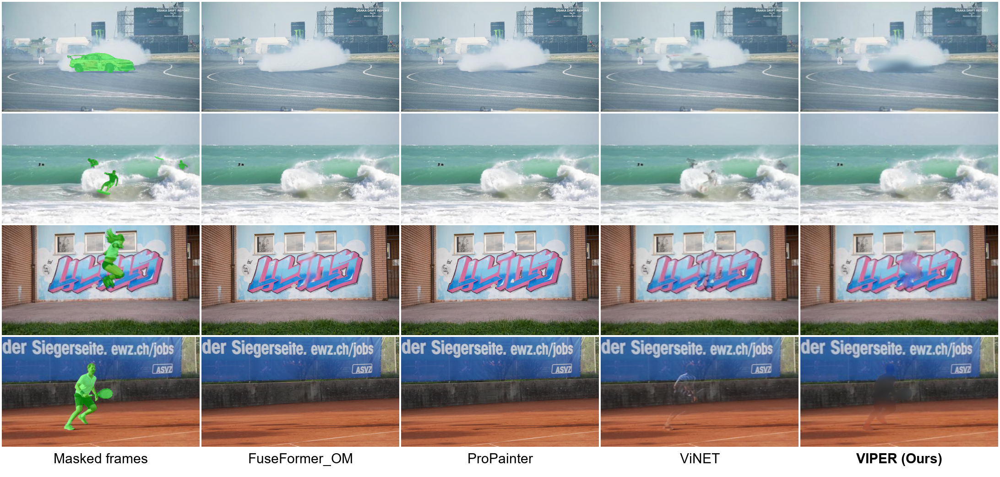
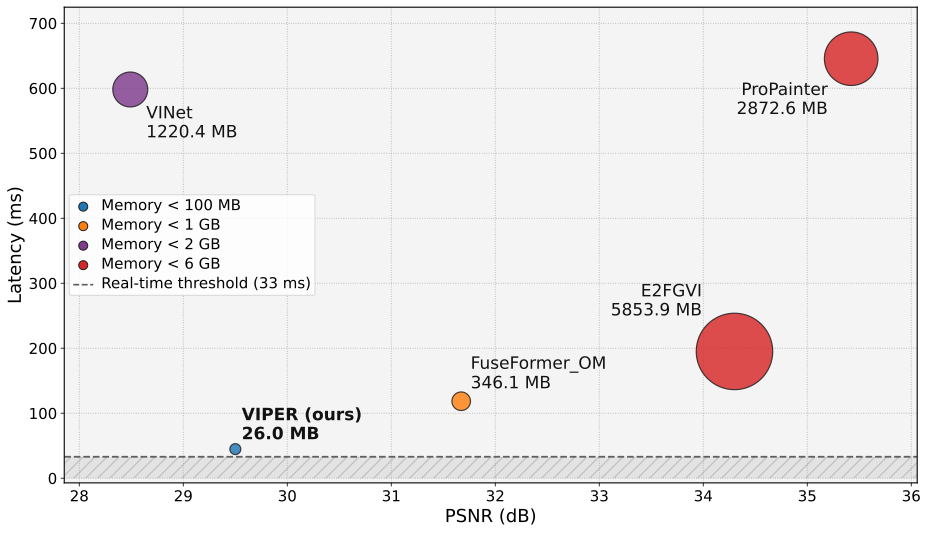

# VIPER — Video Inpainting on Edge Devices in Real-time

To our knowledge, this is the first video inpainter specifically engineered to achieve real-time performance on an edge device. By prioritizing architectural efficiency, VIPER performs seamless object removal and background reconstruction directly on an NVIDIA Jetson Orin Nano 8GB - no cloud GPU required.

---

## Overview

Video inpainting, removing an object from a video and reconstructing what's behind it, frame by frame, is typically the domain of large models running on powerful GPUs. VIPER's core U-Net architecture merges the temporal memory of high-performance video models with the efficiency techniques of state-of-the-art *image* inpainters designed for edge hardware, closing that gap.

## Key Features

- **Optimized Temporal Stability** — ConvGRU modules manage long-term memory and frame consistency, chosen for being 20–30% faster than ConvLSTM while achieving comparable temporal coherence.
- **Gated Depthwise Separable Convolutions** — used throughout the encoder, ConvGRU, and decoder to cut computational complexity by over 90% relative to standard convolutional layers, while letting the model dynamically learn to ignore masked regions.
- **Memory-Efficient Upscaling** — bilinear resize-convolutions combined with Instance Normalization eliminate checkerboard artifacts and prevent color pollution in reconstructed regions.
- **Multi-Frame Input Pipeline** — processes multiple consecutive frames to maintain real-time temporal context across the video.

## Results

### Qualitative Comparison

VIPER produces satisfying inpainting results compared to other existing Convolution Neural Network that are too heavy to run on edge hardware.

### Quality vs. Speed vs. Memory

VIPER sits at the real-time frontier (< 33ms per frame) while maintaining competitive PSNR, something no other method in this comparison achieves simultaneously. Bubble size reflects peak memory usage.

